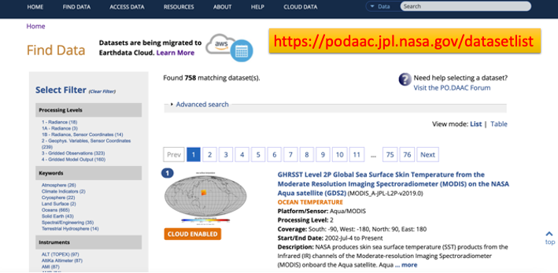

Data Archives and Access
---------------------------

.. toctree::
   :maxdepth: 2
   :caption: Contents:

The very first thing -- EDL and .netrc
~~~~~~~~~~~~~~~~~~~~~~~~~~~~~~~~~~~~~~~~~~~~~~

NASA Earthdata, which includes PO.DAAC data, requires Earthdata Login (EDL) to access. The very first thing is to register an Earthdata Login account (free) from https://urs.earthdata.nasa.gov/.

Once you have registered the EDL, make sure to generate the **.netrc** file in your home directory. Some podaac tools, such as podaac-data-subscriber, will automatically read your EDL credential from the .netrc file. The result is a lifesaver: you do not need to enter your username and password every time you try to download some data.

Here is a well-written instruction from the `podaac-data-subscriber <https://github.com/podaac/data-subscriber>`_ github page: 

Step 1:  Get Earthdata Login     
^^^^^^^^^^^^^^^^^^^^^^^^^^^^^^

This step is needed only if you dont have an Earthdata login already. 

From https://urs.earthdata.nasa.gov/:

     *The Earthdata Login provides a single mechanism for user registration and profile  management for all EOSDIS system components (DAACs, Tools, Services). Your Earthdata login   also helps the EOSDIS program better understand the usage of EOSDIS services to improve  user experience through customization of tools and improvement of services. EOSDIS data are  openly available to all and free of charge except where governed by international  agreements.*

For setting up your authentication, see the notes on the `netrc` file below.

Step 2: Setup your Earthdata Login
^^^^^^^^^^^^^^^^^^^^^^^^^^^^^^^^^^^^^^^
The netrc used within the script  will allow Python scripts to log into any Earthdata Login without being prompted for
credentials every time you run. The netrc file should be placed in your HOME directory.
To find the location of your HOME directory

On UNIX you can use

.. code-block:: console 

    echo $HOME

On Windows you can use

..  code-block:: console

     echo %HOMEDRIVE%%HOMEPATH%

The output location from the command above should be the location of the `.netrc` (`_netrc` on Windows) file.

The format of the `netrc` file is as follows:

.. code-block:: console

     machine urs.earthdata.nasa.gov
         login <your username>
         password <your password>

for example:

.. code-block:: console

     machine urs.earthdata.nasa.gov
         login podaacUser
         password podaacIsAwesome

Were you a hitchhiker to the Galaxy, **.netrc** is your towel. Spend some time, complete it, test it, set it once and for all. It is just a text file with three lines after all. It will save you from the frustration caused by constant popups of the out-of-nowhere error messages blocking you from getting to the data.

Find your data
~~~~~~~~~~~~~~~~~~~~~~~~~~~~~~~~~~~~~~

A glance of All data collections
^^^^^^^^^^^^^^^^^^^^^^^^^^^^^^^^^^^^^^^^^^^^^^

Have you ever wondered for a complete list of all data collections hosted by PODAAC? I have. When the total number is less than several hundred, a complete list can be very handy at times. Here they are.

* `This link points to a table of all PODAAC data collections <https://podaac.jpl.nasa.gov/datasetlist?view=table>`_

* `This link points to a table of all PODAAC data collections in the cloud <https://podaac.jpl.nasa.gov/datasetlist?view=table&provider=POCLOUD>`_.

NASA Earthdata search
^^^^^^^^^^^^^^^^^^^^^^^

PODAAC has 835 data collections, 344 of which have been migrated to the Cloud. By the Fall of 2022, all of the 835 collections will be in the Cloud and PODAAC on-premise services will be gradully deprecated. How to find a data collection that fits to your need?

The ultimate search engine for the NASA Earthdata is through Earthdata Search https://search.earthdata.nasa.gov/search. You can find not only PODAAC data but the data collections from all 12 DAACs. It is built on a centralized database called `The Common Metadata Repository (CMR) <https://cmr.earthdata.nasa.gov/search/>`_, currently has 8729 data collections.

The Earthdata search's interface is straightforward to use:

.. image:: media/earthdatasearch.png
   :width: 700
   :alt: Earthdata search

Search through PODAAC website
^^^^^^^^^^^^^^^^^^^^^^^^^^^^^^^

If you have no interest of non-PODAAC data, https://podaac.jpl.nasa.gov/datasetlist can be a good place to find your data. The filter function in the left panel is particularly useful to narrow down a search.

