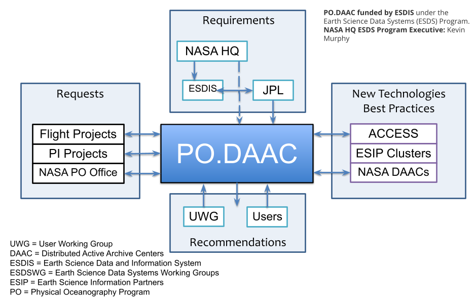

.. toctree::
   :maxdepth: 2
   :caption: Contents:

Introduction
-------------

Logistics
~~~~~~~~~~~~

===========    ===================================================
Location       * In-person: 303-450, JPL, Pasadena, California
               * Online: Webex
Time           August 4-5, 2022
Hotel          `Westin Pasadena <https://www.marriott.com/en-us/hotels/laxpw-the-westin-pasadena/overview/?scid=bb1a189a-fec3-4d19-a255-54ba596febe2&y_source=1_Mjc4MjMxNS03MTUtbG9jYXRpb24ud2Vic2l0ZQ%3D%3D>`_
===========    ===================================================

The User Working Group (UWG) is an important component of PO.DAAC. While UWG is not involved in PO.DAAC's daily operations, it provides PO.DAAC a crucial strategic guidence as well as direct feedback on the current data archives, tools and services. The annual UWG meeting is an important event for PO.DAAC to solicite feedback from UWG and make work plans for the new fiscal year.

UWG Charter
~~~~~~~~~~~~~~

Membership
^^^^^^^^^^^^^^^
* New members are nominated by current or departing members of the UWG; PO.DAAC management; NASA HQ or JPL management.
* The UWG chair and co-chair are determined by consensus of the members.
* Membership is normally 4 years unless serving as chair/co-chair, in which case the period is six years.
* The UWG chair and co-chair will serve a two-year term, after which time the co-chair will assume the role of chair and a new co-chair is recommended by the UWG.
* UWG members are free to renew for a new four-year term by notifying the UWG Chair and getting approval from the appropriate NASA Manager.
* Individual members may resign at any time in writing to the PO.DAAC project scientist and UWG Chair.

Responsibilities
^^^^^^^^^^^^^^^^^^^^
The PO.DAAC UWG is responsible for representing the scientific interests of the research community, providing recommendations and consultation on a broad range of topics and issues related to the definition, design, development, implementation, and operation of the PO.DAAC for physical oceanography and hydrology.
The UWG will:

* Prioritize and provide guidance on PO.DAAC activities, including data acquisition, tools and services, and user support;
* Provide strategic guidance and advice to NASA and PO.DAAC in general;
* Represent the user community in the development and operation of PO.DAAC’s products and services;
* Review the progress and performance of PO.DAAC;
* Be ambassadors for PO.DAAC.

The UWG chair and co-chair will:

* Actively participate in the planning of, and co-lead, the annual meeting and quarterly teleconferences;
* Lead the UWG in developing recommendations for the PO.DAAC;
* Provide a formal report, summarizing recommendations from the annual meeting.

Meetings and Communications
^^^^^^^^^^^^^^^^^^^^^^^^^^^^^^^
* Quarterly teleconferences
* An in-person 2-day meeting
* At least 80% of the members are required, either in person or remotely
* PO.DAAC will cover travel expenses for non-government employees
* Materials and other information may be disseminated throughout the year.
* UWG members are encouraged to reach out to the PO.DAAC Project Scientist at any point during their term with any findings, issues, or inquiries.

PO.DAAC Interfaces
~~~~~~~~~~~~~~~~~~~~

