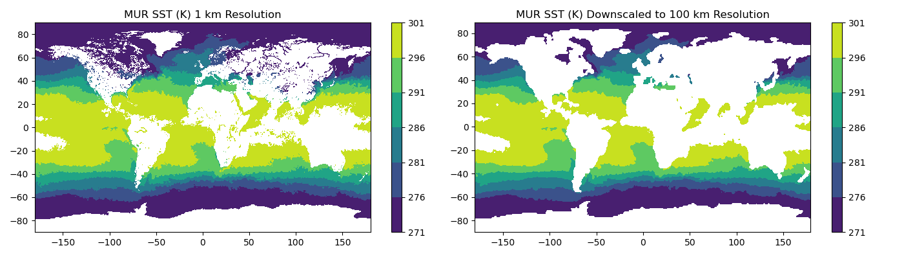

# Performance/Cost Assessment of EC2 Types Using Dask
This directory contains notebooks, scripts, and key results from an anaylsis to compare the performance of several AWS EC2 instance types utilizing Dask parallel computing to perform an earth science-relevant computation.

**Background**

The ability to perform scientific analyses on increasingly large data sets (comprised of either large data files, many data files, or both) is a key target of computing in the cloud, since the necessary computing resources can be utilized by anyone. In AWS, EC2 instances characteristics relevant to parallel computing include:
* Number of CPU cores
* Threads (or vCPUs) per core
* Memory per vCPU (perhaps more relevant than total memory, for parallel computing?)

The goal of this analysis is to assess performance and cost differences between EC2 instances which vary these characteristics.

**Computation and Dataset**

The computation is a downscaling of a MUR 1 km SST data product (https://doi.org/10.5067/GHGMR-4FJ04) to 100 km resolution.

**Figure 1. Example results of downscaling a MUR 1 km SST product**

**Further Resources**

*AWS EC2 instance characteristics:*
* [Tables for memory, bandwith, vCPU count](https://aws.amazon.com/ec2/instance-types/)
* [Tables for CPU cores and threads per core](https://docs.aws.amazon.com/AWSEC2/latest/UserGuide/cpu-options-supported-instances-values.html)
* [AWS discussion of CPU options](https://docs.aws.amazon.com/AWSEC2/latest/UserGuide/instance-optimize-cpu.html)

